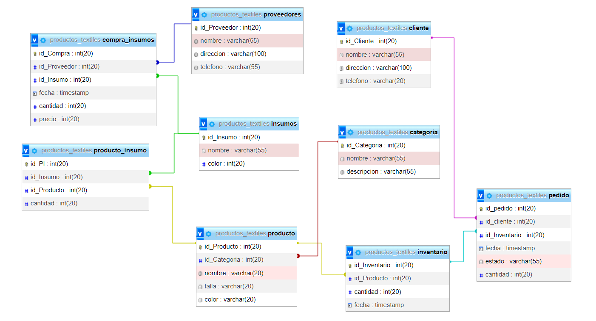

# Gestion de productos textiles deportivos

Desarrollar un sistema de gestión de productos textiles deportivos que permita optimizar el control de productos en inventario, agilizar los procesos de pedidos y facilitar la gestión de produccion y confeccion, asegurando la disponibilidad y entrega eficiente de productos de calidad a los clientes.

Este objetivo se centra en mejorar la gestión de textiles, abarcando aspectos como el control de inventario, los procesos de pedidos y la gestión de ventas. Al establecer este objetivo, el proyecto se enfocará en crear un sistema que agilice los procesos internos y mejore la administracion de insumos en inventario para realizar una produccion mas eficiente asi mismo las entrega de producto.

## __Objetivos especificos:__

**1.** Elaborar la base de datos en MySQL con sus respectivas relaciones entre tablas que permita almacenar y llevar de manera organizada la información relacionada con los datos de la produccion textil:insumos,productos,Producto_Insumo,pedidos,proveedores,clientes,categorias y la compra de insumos.
(se anexa relaciones entre las tablas en la imagen del diagrama)

**2.** Realizar endPoints que permitan ver todos los registros de cada tabla.

**3.** Crear un metodo con el cual se agreguen nuevos registros para cada necesidad.

**4.** Modificar los datos de un producto ya que la produccion esta en constante mejora y correccion de sus productos.

**5.** Eliminar un producto.

**Diagrama de base datos:** 



## __Instalacion:__

* Asegurarse de tener instalado Node.js y npm en tu sistema

**Clonar Repositorio:** Clona este repositorio copiando el siguiente comando en tu terminal:

``git clone https://github.com/LauraRamirezCampus/Gestion-de-productos-textiles-deportivos.git ``

**1. Configura las variables de entorno:** Crea un archivo `.env` en la raíz del proyecto y configura las variables de entorno necesarias. Hay un ejemplo de las variables requeridas en el archivo `.env`.

  (las variables vienen por defecto en el proyecto como usuario root y sin contraseña)

```
MY_CONFIG={"host":"localhost","user":"root","password":"","database":"productos_Textiles","port":3306}
SERVER_CONFIG = {"hostname":"127.1.1.2","port":5507}
JWT="LAURARAMIREZ" 
```

**2. Instalar dependencias:** En la raiz de el proyecto encontraras un archivo llamado  ``package.json`` en el cual se encuentran las dependecias necesarias para que todo funcione,para instalarlas y compilar los archivos DTO debes ejecutar los siguientes comandos:

``npm install``
``npm run tsc ``

Con el anterior comando se instalara automaticamente todas las dependencias que se encuentran en el archivo ``package.json``

**3. Creacion de la base datos:** En el proyecto encontraras un archivo llamado ``db.sql`` en la ruta "Gestion de productos textiles deportivos\data\db.sql" donde podras ejecutar el script con la creacion de la base de datos con sus respectivas relaciones e insercion de datos de prueba.

**4. Iniciar el servidor:** Para iniciar el servidor debes ejecutar el siguiente comando:
``npm run dev``

## __USO:__

* Para utilizar cada endPoint primero necesitas un token de verificacion(Un token diferente para cada endPoint), el cual se genera utilizando la extensión "Thunder Client" en tu entorno de desarrollo de la siguiente manera:

1.Abre la extensión **"Thunder Client"** en tu entorno de desarrollo.

2.Crea una nueva solicitud **GET** a continuacion el ejemplo de URL para el  endPoint de productos:

``http://127.1.1.1:5507/token/i?tabla=Productos``

* Esta te generara el token de permiso para la peticion de productos.
* Una vez tengas el token debes incluirlo en el encabezado( header) de tu solicitud llamado Authorization

El proyecto tiene los siguientes endPoints:

**METODO:GET**

* lista el registro del inventario

URL para generar token de este endPoint:

``http://127.1.1.1:5507/token/i?tabla=Inventario``

Una vez ingresado el token en el encabezado(header) de tu solicitudes puedes hacer esta peticion con esta URL:
``http://127.1.1.1:5507/Inventario``

<hr>

**METODO:GET**

* Busca el registro del inventario por id

``http://127.1.1.1:5507/Inventario/1``

<hr>

**METODO:POST**

* Crea un nuevo registro de inventario

``http://127.1.1.1:5507/Inventario``
Se debe enviar en el Body los datos de la siguiente manera:

```
{
    "id_Inventario": 333,
    "id_Producto": 1,
    "cantidad": 80
  
  }
```

<hr>

**METODO:GET**

* lista los productos ordenados alfabeticamente

URL para generar token de este endPoint:

``http://127.1.1.1:5507/token/i?tabla=Productos``

Una vez ingresado el token en el encabezado(header) de tu solicitudes puedes hacer esta peticion con esta URL :
``http://127.1.1.1:5507/Productos``

<hr>

**METODO:GET**

* Busca el producto por id indicando el id del productoque quieres buscar:

``http://127.1.1.1:5507/Productos/1``

<hr>

**METODO:POST**

* Crea un nuevo producto

``http://127.1.1.1:5507/Productos``

Se debe enviar en el Body los datos de la siguiente manera:

```
{
    "id_Producto": 678,
    "id_Categoria": 1,
    "nombre": "Camisa be ",
    "talla": "M",
    "color": "Azul"
  }
```

<hr>

**METODO:PUT**

* Modificar un producto indicando el id del producto que quieres modificar:

``http://127.1.1.1:5507/Productos/1``

Envias en el Body los datos de la siguiente manera:

```
{
    "id_Producto": 4567,
    "id_Categoria": 1,
    "nombre": "Camisa be ",
    "talla": "M",
    "color": "Morada"
  }

```

<hr>

 **METODO:DELETE**

* Elimina un producto indicando el id del producto que quieres eliminar:

 ``http://127.1.1.1:5507/Productos/1``

<hr>

**METODO:GET**

* lista los Proveedores

URL para generar token de este endPoint:

``http://127.1.1.1:5507/token/i?tabla=Proveedores``

Una vez ingresado el token en el encabezado(header) de tu solicitudes puedes hacer esta peticion con esta URL:
``http://127.1.1.1:5507/Proveedores``

<hr>

**METODO:GET**

* Busca el  Proveedor por id

``http://127.1.1.1:5507/Proveedores/1``

<hr>

**METODO:POST**

* Crea un nuevo Proveedor

``http://127.1.1.1:5507/Proveedores``
Se debe enviar en el Body los datos de la siguiente manera:

```
{
    "id_Proveedor": 189,
    "nombre": "Proveedor central",
    "direccion": "Calle 123, Ciudad X",
    "telefono": "99999999"
  }
```

<hr>

**METODO:GET**

* lista los Insumos

URL para generar token de este endPoint:

``http://127.1.1.1:5507/token/i?tabla=Insumos``

Una vez ingresado el token en el encabezado(header) de tu solicitudes puedes hacer esta peticion con esta URL:
``http://127.1.1.1:5507/Insumos``

<hr>

**METODO:GET**

* Busca el  Insumos por id

``http://127.1.1.1:5507/Insumos/1``

<hr>

**METODO:POST**

* Crea un nuevo Insumos

``http://127.1.1.1:5507/Insumos``
Se debe enviar en el Body los datos de la siguiente manera:

```
{
    "id_Insumo": 789,
    "nombre": "Tela Elástica",
    "color": "Azul"
  }
```

<hr>

**METODO:GET**

* lista las Compras de Insumos

URL para generar token de este endPoint:

``http://127.1.1.1:5507/token/i?tabla=CompraInsumo``

Una vez ingresado el token en el encabezado(header) de tu solicitudes puedes hacer esta peticion con esta URL:
``http://127.1.1.1:5507/CompraInsumo``

<hr>

**METODO:GET**

* Busca la Compra de Insumo por id

``http://127.1.1.1:5507/CompraInsumo/1``

<hr>

**METODO:POST**

* Crea un nuevo registro de Compra de Insumo

``http://127.1.1.1:5507/CompraInsumo``
Se debe enviar en el Body los datos de la siguiente manera:

```
{
    "id_Compra": 1,
    "id_Proveedor": 1,
    "id_Insumo": 1,
    "cantidad": 50,
    "precio": 5000
  }
```

<hr>

**METODO:GET**

* lista los Pedido.

URL para generar token de este endPoint:

``http://127.1.1.1:5507/token/i?tabla=Pedido``

Una vez ingresado el token en el encabezado(header) de tu solicitudes puedes hacer esta peticion con esta URL:
``http://127.1.1.1:5507/Pedido``

<hr>

**METODO:GET**

* Busca el Pedido por id

``http://127.1.1.1:5507/Pedido/1``

<hr>

**METODO:POST**

* Crea un nuevo Pedido

``http://127.1.1.1:5507/Pedido``
Se debe enviar en el Body los datos de la siguiente manera:

```
{
    "id_pedido": 1,
    "id_cliente": 1,
    "id_Inventario": 1,
    "estado": "En Proceso",
    "cantidad": 20
  }
```

<hr>

**METODO:GET**

* lista los Cliente.

URL para generar token de este endPoint:

``http://127.1.1.1:5507/token/i?tabla=Cliente``

Una vez ingresado el token en el encabezado(header) de tu solicitudes puedes hacer esta peticion con esta URL:
``http://127.1.1.1:5507/Cliente``

<hr>

**METODO:GET**

* Busca el Cliente por id

``http://127.1.1.1:5507/Cliente/1``

<hr>

**METODO:GET**

* lista los Pedido.

URL para generar token de este endPoint:

``http://127.1.1.1:5507/token/i?tabla=Pedido``

Una vez ingresado el token en el encabezado(header) de tu solicitudes puedes hacer esta peticion con esta URL:
``http://127.1.1.1:5507/Pedido``

<hr>

**METODO:GET**

* Busca el Pedido por id

``http://127.1.1.1:5507/Pedido/1``

<hr>

**METODO:POST**

* Crea un nuevo Pedido

``http://127.1.1.1:5507/Pedido``
Se debe enviar en el Body los datos de la siguiente manera:

```
{
    "id_pedido": 1,
    "id_cliente": 1,
    "id_Inventario": 1,
    "estado": "En Proceso",
    "cantidad": 20
  }
```
